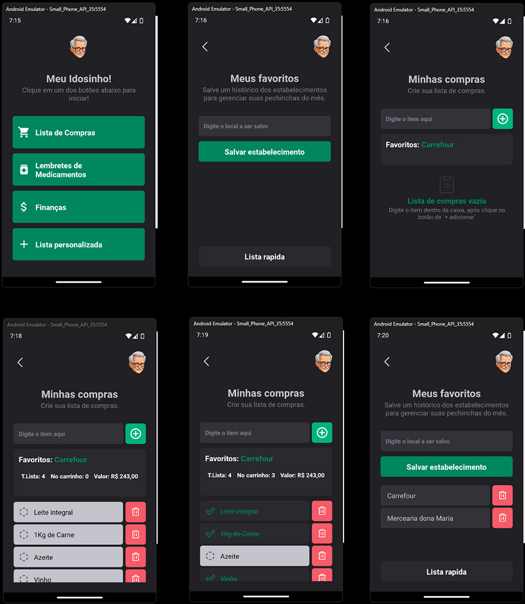

 React-Native Meu Idosinho em desenvolvimento

<a href="#imagens">Imagens </a> -
<a href="#sobre">Sobre </a> -
<a href="#Planejamento">Planejamento </a> -
<a href="#Design da Interface">Design da Interface </a> -
<a href="#Dependencias">Depêndencias</a> -
<a href="#autor">Autor </a>

# Imagens

- Etapas de uso do App. 

<table border>
    <tr>
        <td>Telas Versão - Beta</td>
    </tr>
    <tr>
        <td></td>
    </tr>
</table>

# Sobre

<strong>Meu Idosinho</strong> é um aplicativo intuitivo e acessível, projetado para ajudar idosos a gerenciar suas tarefas diárias com a assistência de um smartphone. Com uma interface amigável e simplificada, o aplicativo garante que os usuários mais velhos possam navegar facilmente e realizar suas atividades sem complicações.

# Planejamento

<strong>1. Planejamento Inicial</strong>

<strong>Funcionalidades Principais</strong>

<strong>#Lista de Compras</strong> 
- [] Refatorar nome das constantes para facilitar na manutenção 
- [x] Criar Screen 
- [x] Adicionar itens 
- [x] Marcar itens como comprados 
- [x] Remover itens 
- [x] Remover itens - REFATORAR apos nova função de vincular mercado a lista de compras 
- [] Indicadores da Lista dinamicos 
- [] Componentizar - Idicadores da Lista dinamicos(...analisar se necessario)  
- [] Refatorar buttons 
- [] Refatorar button ADD do input  

<strong>#Lista de Compras - Market Favoritos</strong> 
- [x] Criar Screen 
- [x] Lista de Mercados favoritos 
- [x] Lista de Mercados favoritos - Adicionar ao storage  
- [x] Lista de Mercados favoritos - Remover ao storage  
- [x] Salvar e vincular MarketFavorito com a lista criada em `Lista de Compras`  

<strong>#Lembretes de Medicamentos</strong> 
- [x] Criar Screen 
- [] Adicionar medicamentos com horários 
- [] Notificações para lembrar de tomar os remédios 
- [] Histórico de medicamentos tomados  

<strong>#Módulo de Finanças</strong> 
- [x] Criar Screen  
- [] Adicionar contas a pagar 
- [] Notificações para lembrar de pagar as contas 
- [] Histórico de pagamentos  

# Design da Interface

<strong>1. Design da Interface
Simplicidade e Acessibilidade
Ícones grandes e intuitivos
Fontes grandes e legíveis
Navegação fácil e direta</strong>

<strong>2. Desenvolvimento 
Estrutura do Projeto: 
React Native para desenvolvimento multi-plataforma (iOS e Android)</strong>

# Dependencias

<strong>Dependências</strong>

-- react-navigation: Para navegação entre telas 
-- styled-components: Para estilização 
-- @expo-google-fonts/roboto: Para fontes legíveis 
-- expo-notifications: Para gerenciar notificações 
-- react-navigation/native:Tipo <strong>STACK</strong> Para navegabilidade
-- Outras dependências conforme necessário  
<ul>
    <li>npx expo install react-native-svg</li>
    <li>npx expo install @expo-google-fonts/roboto expo-font</li>
    <li>npm install --save phosphor-react-native</li>
    <li>npm install styled-components --legacy-peer-deps</li>
    <li>npm install --save-dev babel-plugin-module-resolver --legacy-peer-deps</li>
    <li>npm install @react-navigation/native --legacy-peer-deps</li>
    <li>npx expo install react-native-screens react-native-safe-area-context -- --legacy-peer-deps</li>
    <li>npm install @react-navigation/native-stack --legacy-peer-deps</li>
    <li>npx expo install @react-native-async-storage/async-storage -- --legacy-peer-deps</li>
    <li><a href="https://github.com/duongdev/phosphor-react-native">phosphor-react-native</a></li>
</ul>

# Autor

Desenvolvido por: :nerd_face: <a href="https://github.com/NeillonWork"><strong> NeillonWork</strong>

